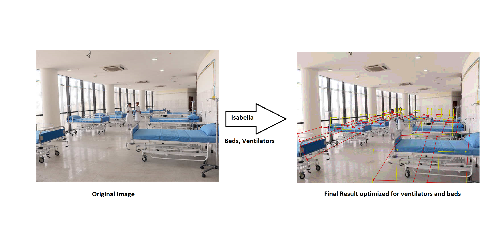
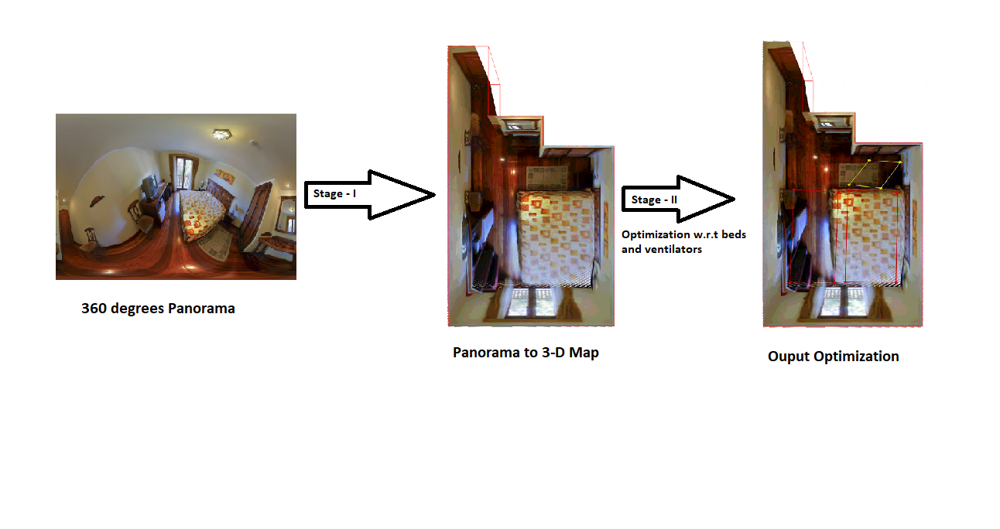

# _isabella
Complete Space Optimization (Currently in Development)

## Visualization

Isabella Reorganizing things in such a way that we can maximum area possible.

Converting a panorama into 3-D Map, where polynomial spatial optmization is performed for fitting n things, where n is a number denoting stuff like beds, chairs, tables, monitors, ventilators etc.
## Acknowledgement
```
@article{wang2020solov2,
  title={SOLOv2: Dynamic, Faster and Stronger},
  author={Wang, Xinlong and Zhang, Rufeng and  Kong, Tao and Li, Lei and Shen, Chunhua},
  journal={arXiv preprint arXiv:2003.10152},
  year={2020}
}
```
```
@article{Alhashim2018,
  author    = {Ibraheem Alhashim and Peter Wonka},
  title     = {High Quality Monocular Depth Estimation via Transfer Learning},
  journal   = {arXiv e-prints},
  volume    = {abs/1812.11941},
  year      = {2018},
  url       = {https://arxiv.org/abs/1812.11941},
  eid       = {arXiv:1812.11941},
  eprint    = {1812.11941}
}
```
```
@inproceedings{SunHSC19,
  author    = {Cheng Sun and
               Chi{-}Wei Hsiao and
               Min Sun and
               Hwann{-}Tzong Chen},
  title     = {HorizonNet: Learning Room Layout With 1D Representation and Pano Stretch
               Data Augmentation},
  booktitle = {{IEEE} Conference on Computer Vision and Pattern Recognition, {CVPR}
               2019, Long Beach, CA, USA, June 16-20, 2019},
  pages     = {1047--1056},
  year      = {2019},
}
```
